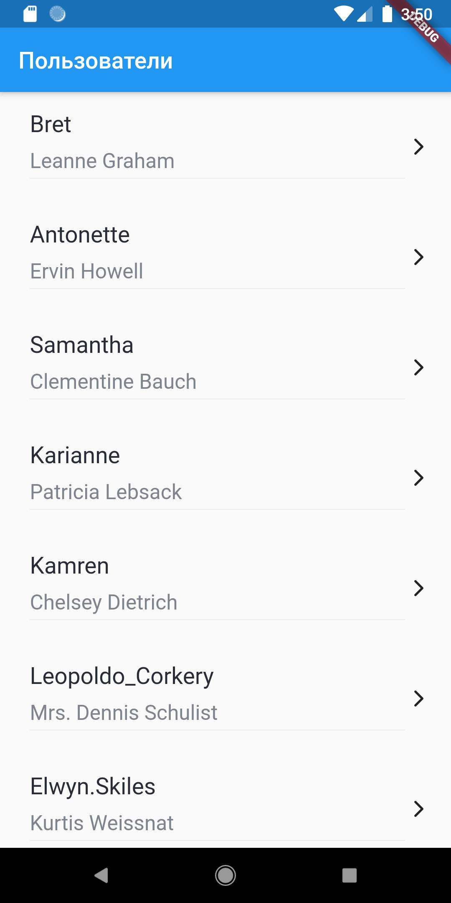
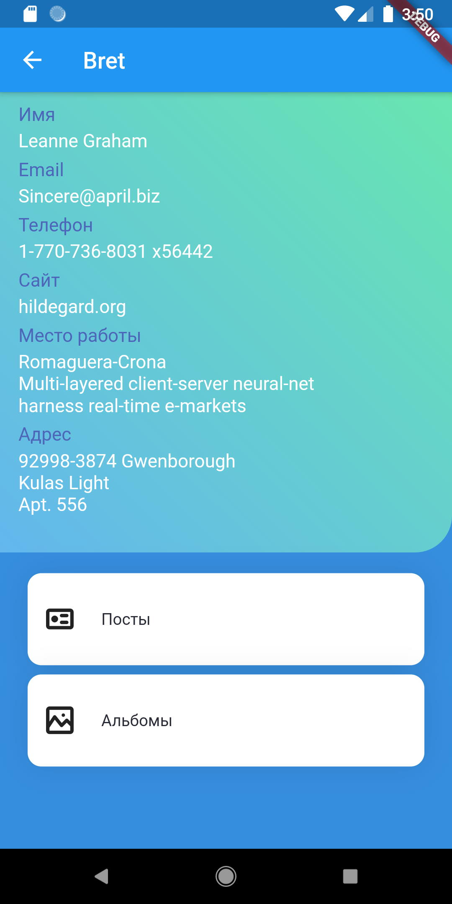
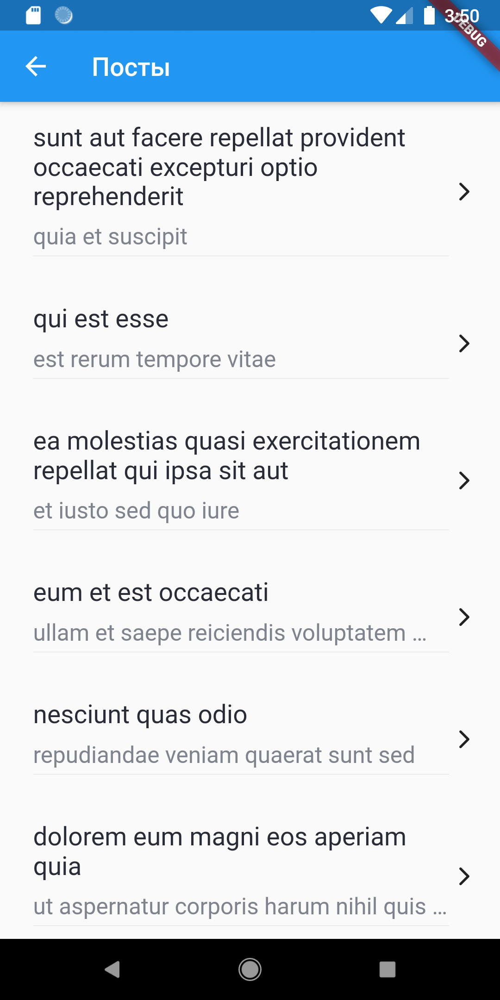
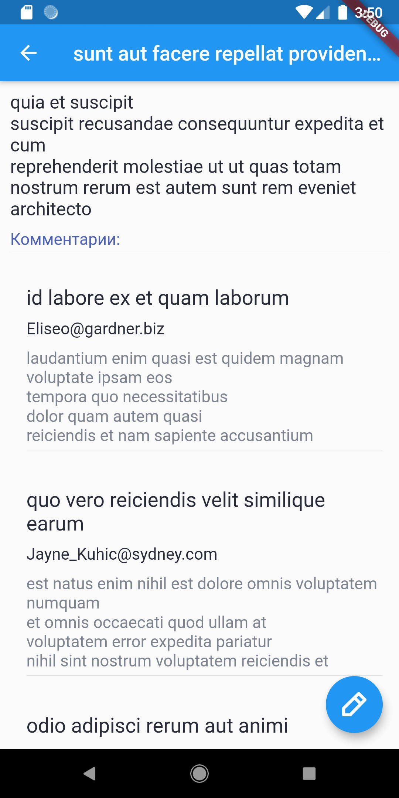
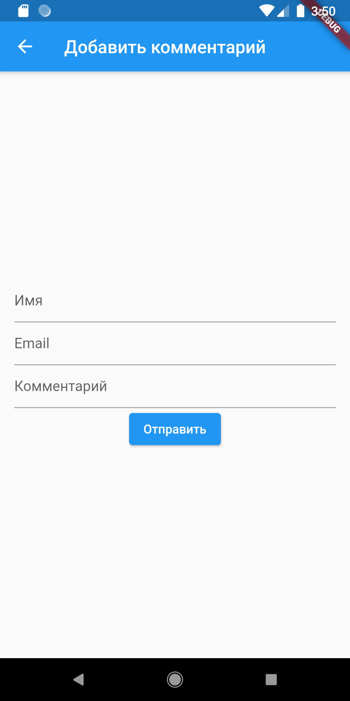
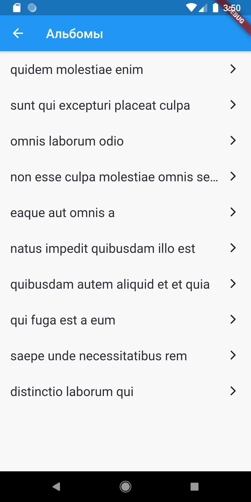
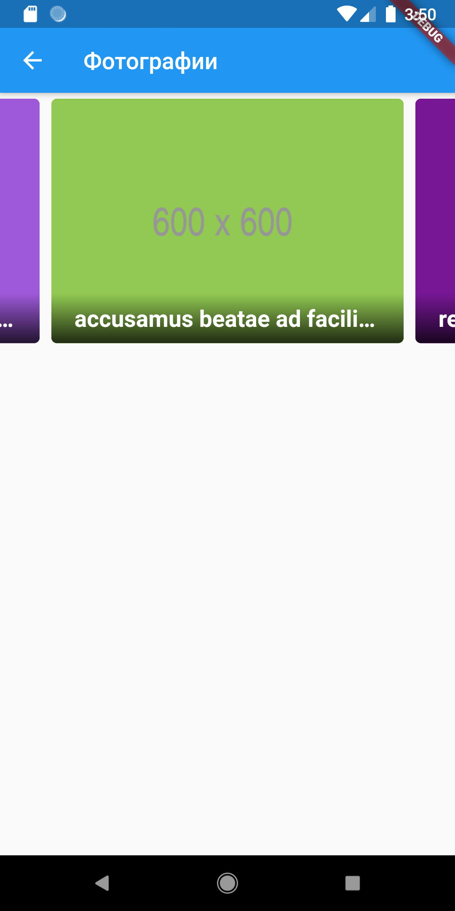

# flutter_jsonplaceholder
Flutter проект на основе запросов к https://jsonplaceholder.typicode.com
* Users 
* Posts
* Comments
* Albums
* Photos

## Дополнительно
* Страница пользователя. Подробный вывод информации о пользователе.
* Псевдо добавление нового комментария к посту.
* Все фото альбома с описанием в виде слайдера.
* Все полученные данные сохраняютсял окально, используя пакет SharedPreferences, и повторно не запрашиваются если уже получены.

## Screenshots

